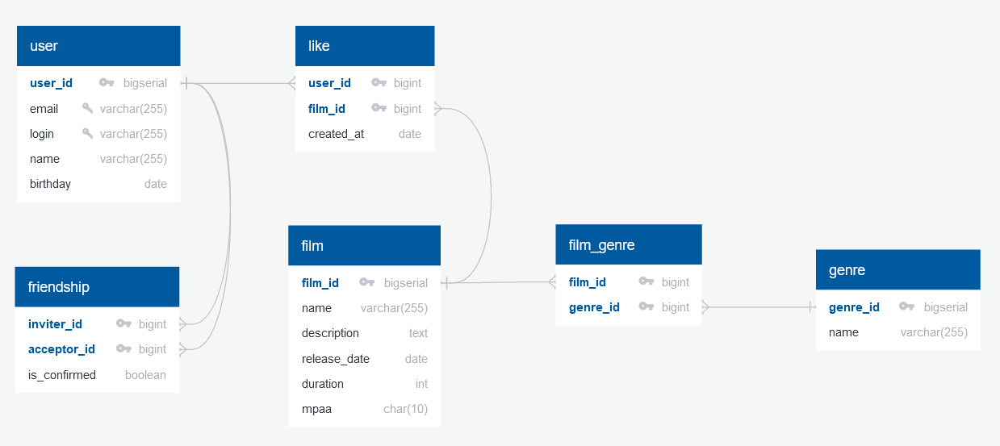

# java-filmorate

##My branch




## Avoiding composite primary key permutations on friendship table
```sql
    CREATE TABLE friendship (
      inviter_id BIGINT NOT NULL,
      acceptor_id BIGINT NOT NULL,
      is_confirmed BOOLEAN NOT NULL,
      CONSTRAINT uq1 UNIQUE (
        (LEAST(inviter_id, acceptor_id)), (GREATEST(inviter_id, acceptor_id))
      ),
      PRIMARY KEY (inviter_id, acceptor_id)
    );
```

## Examples of DB queries

### Add a user
```sql
    INSERT INTO user (email, login, name, birthday) 
    VALUES ('email@example.com', 'john_doe', 'John Doe', '1988-04-22');
```

### Update a user
```sql
    UPDATE user
    SET name = 'Jane Doe'
    WHERE user_id = 1; 
```

### Make two user friends
```sql
    INSERT INTO friendship (inviter_id, acceptor_id, is_confirmed) 
    VALUES (1, 2, true);
```

### Unfriend users
```sql
    DELETE FROM friendship 
    WHERE (inviter_id = 1 AND acceptor_id = 2)
        OR (inviter_id = 2 AND acceptor_id = 1);
```

### Get user's friends
```sql
    SELECT *
    FROM user AS u
    WHERE u.user_id IN (
        (SELECT acceptor_id AS user_id FROM friendship WHERE inviter_id = 1 AND is_confirmed IS TRUE)
        UNION
        (SELECT inviter_id AS user_id FROM friendship WHERE acceptor_id = 1 AND is_confirmed IS TRUE)
    );
```

### Get common friends of two users
```sql
    SELECT *
    FROM user AS u
    WHERE u.user_id IN (
        (SELECT acceptor_id AS user_id FROM friendship WHERE inviter_id = 1 AND is_confirmed IS TRUE)
        UNION
        (SELECT inviter_id AS user_id FROM friendship WHERE acceptor_id = 1 AND is_confirmed IS TRUE)
    ) 
    AND u.user_id IN (
        (SELECT acceptor_id AS user_id FROM friendship WHERE inviter_id = 2 AND is_confirmed IS TRUE)
        UNION
        (SELECT inviter_id AS user_id FROM friendship WHERE acceptor_id = 2 AND is_confirmed IS TRUE)
    );
```

### Add a film
```sql
    INSERT INTO film (name, description, release_date, duration, mpaa_id) 
    VALUES ('John Wick', 'Film with Keanu Reeves', '2014-09-19', 6060, 1);
```

### Update a film
```sql
    UPDATE film
    SET description = 'Best film with Keanu Reeves ever'
    WHERE film_id = 1; 
```

### Mark a film as liked by user
```sql
    INSERT INTO `like` (user_id, film_id, created_at) 
    VALUES (1, 1, '2022-05-14');
```

### Unlike film
```sql
    DELETE FROM `like` 
    WHERE user_id = 1 AND film_id = 1;
```

### Get films list ordered by popularity
```sql
    SELECT f.*, 
           COUNT(DISTINCT l.user_id) AS unique_likes
    FROM film AS f
    LEFT JOIN `like` AS l on f.film_id = l.film_id
    GROUP BY f.film_id
    ORDER BY unique_likes DESC;
```